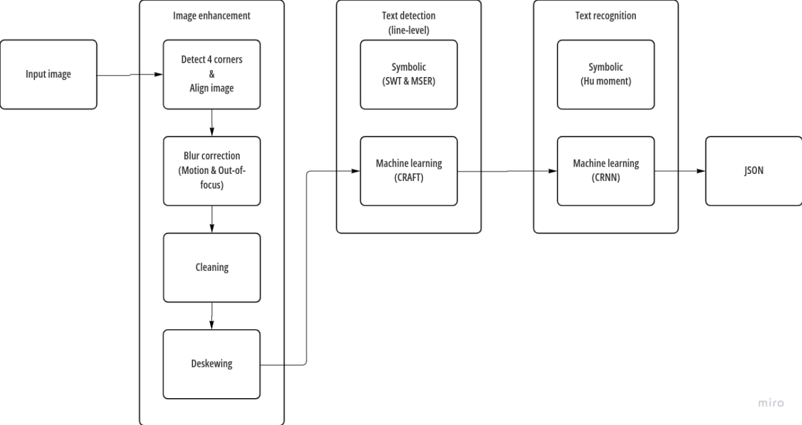

# OCR

## Install

The repository comes with Pytorch `.pth` weights, so your machine should have Git Large File already installed before cloning, or else the `.pth` weights might be broken and the program will crash. Following this guide to install Git Large File.
```
curl -s https://packagecloud.io/install/repositories/github/git-lfs/script.deb.sh | sudo bash
sudo apt-get install git-lfs
git lfs install
```

Clone repo and install [requirements.txt](requirements.txt) in a Python>=3.8.0 environment with Tkinter installed.

```
git config http.postBuffer 524288000
git clone https://github.com/LapTQ/IT4343E_OCR.git
cd IT4343E_OCR
pip install -r requirements.txt
```

## Usage

**Note**: This repository should be run on local machine only because during execution we prompt some interactive windows, which might not be supported by web-browser environments like Colab.

The script accepts single image as input.

```
python3 run.py --input path/to/image --output path/to/folder
```

Arguments:
* `--input`: path to an image.
* `--output`: path to a directory where the output is stored (default to [output](output) if user does not specify). 

The output includes a `.json` file and a demo image (for visualization purpose). In addition, we save intermediate result in the [cache](cache) folder for convenience.

## Workflow

As for the flow of execution, see picture below.



For fast and efficient pre-processing, in our project we use classical image processing techniques, leaving the text detection and recognition stages for deep learning.
* Text detection: CRAFT
* Text recognition: We are temporarily using Transformer OCR by VietOCR due to some issues in our own model.

For the details of techniques used in this project, please see [report](report.pdf).

## Contributors

This repository is following the course project in class IT4343E - Computer Vision. We would like to express our sincere gratitude to PhD. Dinh Viet Sang for guiding this course project.

Group members:
* Hoang Nguyen Minh Nhat - 20194445
* Pham Thanh Truong - 20194460
* Pham Thanh Hung - 20194437
* Tran Quoc Lap - 20194443

